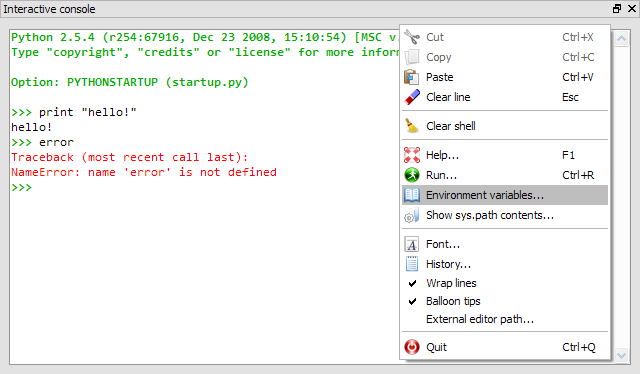

Interactive Console
===================

The interactive console is a Python interpreter executed in the *same thread* 
as Pydee's graphical user interface, providing unique features such as
``matplotlib`` figures integration or MATLAB-like workspace.

Related plugins
---------------

:doc:`workspace`
:doc:`docviewer`
:doc:`historylog`
:doc:`editor`
:doc:`explorer`

The thread safe issue
---------------------

The interactive console being not thread safe, one must be conscious that **any 
blocking command send to the console will freeze the whole application**, i.e. 
the whole GUI (Graphical User Interface) will be unavailable until command 
interpretation is over: events will not be processed by the GUI main loop, 
including keyboard events - meaning that not only the interface will be freezed 
but it won't be possible to interrupt the process by pressing ``Ctrl+C``.

However, there is one exception to this behaviour: standard output or error 
streams will automatically refresh interactive console's widget by asking the 
GUI event loop to process queued events. This will also give the opportunity 
to the rest of Pydee's GUI to refresh. In other words, an infinite loop with 
``print`` statements will not freeze Pydee's GUI and it will even be possible 
to interrupt it with ``Ctrl+C``.

To sum up, when using the interactive console, please keep in my mind this 
thread-safe issue and eventually think about writing ``print`` statements in 
loops if you want to be able to interrupt them (when debugging for example).

Of course, Pydee has a solution to this thread-safe issue: the 
:doc:`extconsole`, a Python interpreter executed in a separate process. 
But there is a price to pay: more safety, less interactivity 
(no ``matplotlib`` integration).

Special commands
----------------

The following special commands are supported by the interactive console.

- Edit script

  ``edit foobar.py`` will open ``foobar.py`` with Pydee's editor.
  ``xedit foobar.py`` will open ``foobar.py`` with the external editor.

- Execute script

  ``run foobar.py`` will execute ``foobar.py`` in interactive console.

- Remove references

  ``clear x, y`` will remove references named ``x`` and ``y``.
  
- Shell commands

  ``!cmd`` will execute system command ``cmd`` (example ``!ls`` on Linux or
  ``!dir`` on Windows).
  
- Python help

  ``object?`` will show ``object``'s help in documentation viewer.
  
- GUI-based editor

  ``oedit(object)`` will open an appropriate GUI-based editor to modify object
  ``object`` and will return the result.

